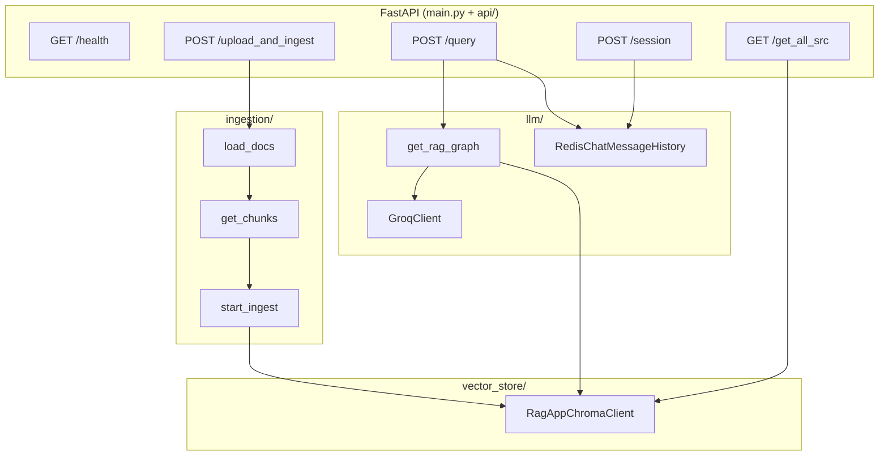

# RAG App Backend

A **Retrieval-Augmented Generation (RAG)** backend built with **FastAPI**. Users upload documents, which are chunked, embedded, and stored in **ChromaDB Cloud**. Questions are answered by retrieving relevant chunks and sending them to **Groq's Llama 3.3 70B** model. Chat history is stored in **Redis**.

The system follows a standard RAG pipeline:

**Document → Chunking → Embeddings → Vector Store → Retrieval → LLM Response**

---

## High-Level Architecture



**End-to-end flow:**

1. **Ingest:** Upload → save to `data/` → load & chunk → embed → ChromaDB
2. **Query:** Question → LangGraph (retrieve → generate) → answer → save to Redis history

---

## Project Structure

| Path | Role |
|------|------|
| `main.py` | FastAPI app entry point |
| `api/route.py` | HTTP endpoints |
| `api/schema.py` | Pydantic request/response models |
| `ingestion/ingest.py` | Document loading, chunking, ingestion |
| `vector_store/chroma_client.py` | ChromaDB Cloud client (embeddings, search) |
| `llm/chat.py` | LangGraph RAG pipeline + Redis chat history |
| `llm/groq_client.py` | Groq LLM wrapper and prompts |
| `config/logging.py` | Centralized logging setup |
| `pyproject.toml` / `requirements.txt` | Dependencies |
| `data/` | Temporary upload folder (gitignored contents) |

---

## Technology Stack

### AI Frameworks

- **LangChain** — Orchestrates the RAG pipeline
- **LangGraph** — Manages LLM interaction workflows

### LLM Provider

- **Groq AI**

### Model Used

- **llama-3.3-70b-versatile**
  - 70B parameters → high-quality responses
  - Optimized for general tasks such as chat, reasoning, coding, and RAG applications

### Backend API

- **FastAPI**

### Vector Database

- **ChromaDB Cloud**

### Other Libraries

- Pydantic
- Redis (for chat session history)
- Logging
- python-dotenv (`.env`)

---

## Entry Point: `main.py`

Creates the FastAPI app, configures logging, and mounts all routes under `/api`.

```python
from fastapi import FastAPI
from api.route import router

from config.logging import setup_logging
setup_logging()

app = FastAPI(title="RAG APP")
app.include_router(router)
```

---

## API Layer

### Schemas (`api/schema.py`)

Pydantic models for validation and OpenAPI docs:

- **QueryRequest** — `query`, `session_id`, `user_id` (optional `chat_history`, unused in routes)
- **QueryResponse** — `question`, `chat_history`, `answer`
- **IngestionResponse** — `status`, `filename`, `exception`
- **AllSrcResponse** — list of ingested source file paths
- **SessionCreateRequest/Response** — create a new chat session

### Routes (`api/route.py`)

All routes use prefix `/api`:

| Endpoint | Method | Purpose |
|----------|--------|---------|
| `/health` | GET | Health check → `{"status": "Okay"}` |
| `/session` | POST | Create session UUID, clear Redis history for that user+session |
| `/query` | POST | Run RAG pipeline, update chat history |
| `/upload_and_ingest` | POST | Upload file, ingest into Chroma, delete temp file |
| `/get_all_src` | GET | List unique document sources in Chroma |

#### Query flow (`/query`)

1. Build LangGraph via `get_rag_graph()`
2. Load Redis history with key `{user_id}:{session_id}`
3. Invoke graph with `question` + `chat_history`
4. Append user question and AI answer to Redis
5. Return response

#### Upload flow (`/upload_and_ingest`)

1. Save uploaded file to `data/`
2. Call `start_ingest()` (processes everything in `data/`)
3. Delete the uploaded file
4. Return success/failure (errors are caught, not re-raised)

Heavy imports (`ingestion`, `chroma_client`) are deferred inside route handlers to reduce startup time.

---

## Ingestion Pipeline (`ingestion/ingest.py`)

### 1. Document loading (`load_docs`)

Scans the `data/` directory and picks a loader by extension:

- `.pdf` → `PyMuPDFLoader`
- `.txt` → `TextLoader`
- `.docx` → `Docx2txtLoader`
- Other → `UnstructuredLoader` (auto strategy)

### 2. Chunking (`get_chunks`)

Uses `RecursiveCharacterTextSplitter`:

- **chunk_size:** 700
- **chunk_overlap:** 150

### 3. Ingestion (`start_ingest`)

1. Gets chunks from all files in `data/`
2. Builds parallel lists: text content, metadata (`source`, `page`), IDs (`id0`, `id1`, …)
3. Calls `RagAppChromaClient.add_documents()`

> **Note:** Ingestion runs on **all files in `data/`**, not only the uploaded file. After upload the file is deleted, so typically only that file is processed—but if others remain in `data/`, they are included too.

---

## Vector Store (`vector_store/chroma_client.py`)

`RagAppChromaClient` is a **singleton** wrapping **ChromaDB Cloud**.

### Configuration (from `.env`)

- `CHROMA_API_KEY`, `TENANT`, `CHROMA_DB`, `RAG_APP_COLL`
- Embedding model: **`all-MiniLM-L6-v2`** (Sentence Transformers)

### Key methods

| Method | Behavior |
|--------|----------|
| `add_documents` | Batch insert (size 30); skips if source already exists |
| `source_exists` | Checks Chroma for existing `source` metadata |
| `get_available_srcs` | Unique source paths in the collection |
| `mmr_search` | MMR retrieval, **k=5** (used by RAG) |
| `qurey_chroma` | Basic similarity query, **n=3** (typo in name; not used in main flow) |

Connection retries up to 3 times on failure.

Embeddings use both:

- Chroma's `SentenceTransformerEmbeddingFunction` (for storage)
- LangChain's `HuggingFaceEmbeddings` (for MMR search via LangChain's Chroma wrapper)

---

## LLM & RAG Pipeline (`llm/`)

### Groq client (`groq_client.py`)

- Model: **`llama-3.3-70b-versatile`**
- API key: `GROQ_API_KEY`
- **`get_context_prompt_template()`** — used by RAG:
  - System: answer from context only
  - Chat history placeholder
  - System: context block
  - Human: question
- **`get_prompt_template()`** — simpler Q&A without context (standalone test only)

### LangGraph RAG (`chat.py`)

State shape (`RAGState`):

```python
question: str
chat_history: list[BaseMessage]
context: list[Document]
answer: str
```

**Graph:**

```
retriever → generate → END
```

1. **`retriever`** — `RagAppChromaClient.mmr_search(question)` → fills `context`
2. **`generate`** — formats prompt with question, history, and joined context → Groq LLM → `answer`

### Chat history

- **Production path:** `RedisChatMessageHistory` with session key `{user_id}:{session_id}`
- **Unused helper:** `get_inMem_history()` — in-memory store capped at 5 sessions (legacy/alternative)

Redis URL is built from `REDIS_DB_PWD`, `REDIS_CLOUD_HOST`, `REDIS_PORT`.

---

## Logging (`config/logging.py`)

- Format: `timestamp|level|logger|message`
- Stdout handler
- Quiets noisy libs: `langchain`, `chromadb`, `httpx` at WARNING; `langgraph` at INFO

---

## Required Environment Variables

| Variable | Used by |
|----------|---------|
| `GROQ_API_KEY` | Groq LLM |
| `CHROMA_API_KEY`, `TENANT`, `CHROMA_DB`, `RAG_APP_COLL` | Chroma Cloud |
| `REDIS_DB_PWD`, `REDIS_CLOUD_HOST`, `REDIS_PORT` | Chat history |

`chroma_client.py` loads `.env` via `python-dotenv`; other modules rely on env vars being set externally.

---

## Typical Usage Sequence

1. **Create session** — `POST /api/session` with `user_id` → get `session_id`
2. **Upload document** — `POST /api/upload_and_ingest` with file
3. **Ask questions** — `POST /api/query` with `query`, `user_id`, `session_id`
4. **List sources** — `GET /api/get_all_src`

---

## System Workflow

### 1. Ingestion Pipeline

The ingestion process converts documents into searchable vector embeddings.

1. **Document Loading** — The system reads input documents.
2. **Text Chunking** — Documents are split using `chunk_size = 700` and `chunk_overlap = 150`.
3. **Embedding Generation** — Each chunk is embedded with **Sentence Transformer Model:** `all-MiniLM-L6-v2`.
4. **Vector Storage** — Embeddings are stored in **ChromaDB** for similarity search.

### 2. Retrieval Pipeline

When a user submits a query:

1. **Query Embedding** — The user query is converted into an embedding.
2. **MMR Search** — ChromaDB retrieves relevant chunks using **MMR (Maximal Marginal Relevance)**, ensuring results are relevant and diverse (non-redundant).
3. **Similarity Matching** — Embedding similarity search identifies the most relevant document chunks.

> **Note:** BM25-based retrieval could further improve keyword-based search performance.

### 3. Response Generation (Chat Pipeline)

1. Retrieved document chunks are passed as **context** to the LLM.
2. The **Groq-hosted Llama-3.3-70B-Versatile model** generates a structured and context-aware response.

---

## Design Notes & Quirks

1. **Duplicate ingestion guard** — Same file path won't be re-ingested if `source` already exists in Chroma.
2. **Lazy imports** — Ingestion and Chroma imports inside route handlers speed cold start.
3. **ID generation** — Chunk IDs are `id0`, `id1`, …; re-ingesting different docs could collide if old IDs aren't cleared (mitigated by `source_exists` skip).
4. **`QueryRequest.chat_history`** — Defined in schema but not used; history comes from Redis.
5. **`get_inMem_history`** — Defined but unused; Redis is the active store.
6. **Error handling on upload** — Failures return `status: "Failed"` instead of HTTP 500.
7. **Dependencies** — LangChain ecosystem, LangGraph, Chroma, Groq, Redis, PyMuPDF, Unstructured, FastAPI, PyTorch/sentence-transformers for embeddings.

---

## Output


